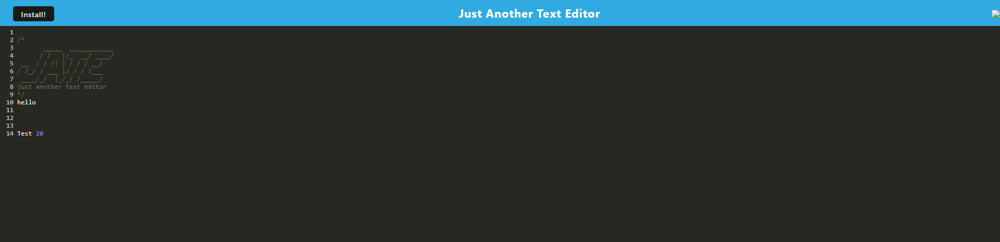

# Text-Editor

## Description

My motivation for this project was to get more familiar through PWA. I built this because I wanted to become more familiar and more comfortable with using PWA's and gain a better understanding. This helps create notes or code snippets with or without internet connection that you are able to use later.

## Installation

1- open the application through your terminal and install all your depedencies. 2- type in 'npm run build' which will give you your dist folder and then type in 'npm run start' to start the application. 3- once the application opens you are then able to edit and type in the text you want and even install (click the install button OR install through your URL icon).

## Usage

    

## Credits

Quinn - https://github.com/qkeddy

Mike - https://github.com/Mikefedele

Kyle - https://github.com/kgiunta

Kaleb - https://github.com/kaleb1027

Dom - https://github.com/dev-dominick

Scott McAnally - Tutor

## License

MIT License

## Tests

N/A

## Links

Github Repo - https://github.com/CallMeIce/Text-Editor

Heroku App - https://secure-cliffs-39156.herokuapp.com/
